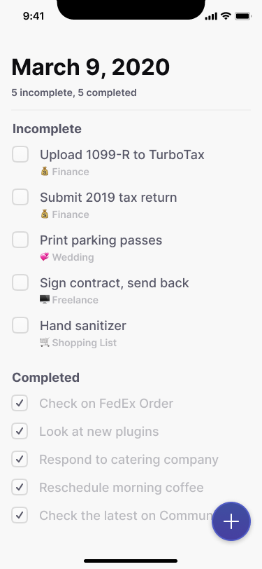

# Codelab Todo App

A simple todo app UI for to showcase Flutter and Dart core concepts: widgets, state, MaterialApp, and data structures. It was made for the first codelab of Flutter Bénin community of 2022.

> ## :iphone:  Design Inspiration

Link [here](https://www.figma.com/file/7w4P0hjiz3Bitixe9ZpAyh/A-Simple-To-Do-App%2C-Built-with-Auto-Layout-(Community)?node-id=19%3A2)

> ## :sunglasses:  Contributors

**Junior Medehou** 

**Flutter Bénin** 

> ## :electric_plug:  Plugins inside

We have used [Gap](https://pub.dev/packages/gap).

## Getting Started

This project is a starting point for a Flutter application.

A few resources to get you started if this is your first Flutter project:

- [Lab: Write your first Flutter app](https://flutter.dev/docs/get-started/codelab)
- [Cookbook: Useful Flutter samples](https://flutter.dev/docs/cookbook)

For help getting started with Flutter, view our
[online documentation](https://flutter.dev/docs), which offers tutorials,
samples, guidance on mobile development, and a full API reference.
